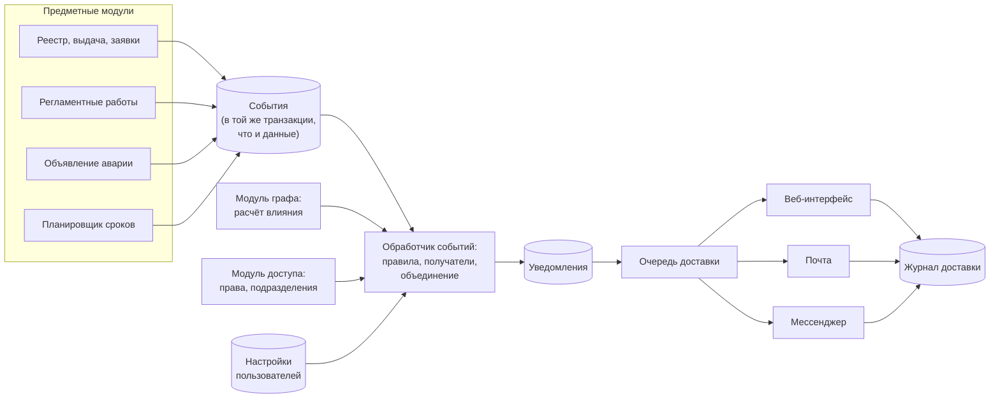
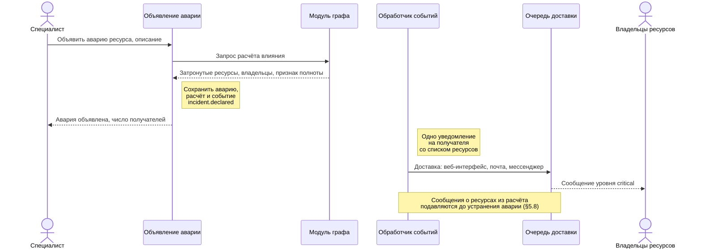
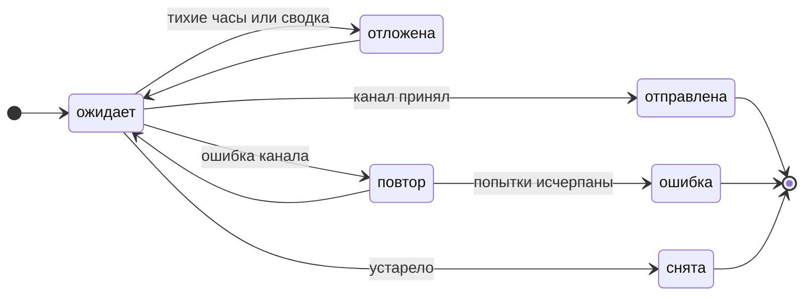

# 05. Оповещения

Этап: **постановка задачи и анализ решений**. Сценарии и предложения ниже
предназначены для обсуждения командой до подготовки подробных требований.

## 5.1 Постановка задачи

Подсистема оповещений сообщает пользователю о касающемся его событии по выбранному
им каналу в срок, заданный уровнем важности события.

- **Вход:** события предметных модулей; расчёт влияния из модуля графа;
  пользователи, роли, права и подразделения из модуля доступа; настройки пользователя.
- **Выход:** уведомления в веб-интерфейсе; сообщения по почте и в мессенджер;
  журнал доставки.
- **Не входит:** обнаружение сбоев — аварию объявляет пользователь
  ([раздел 01](01-vision.md), §1.4); дежурства по графику; рассылки вне организации.

## 5.2 Сценарии

| № | Сценарий | Источник |
|---|---|---|
| О1 | **Объявление аварии.** Специалист объявляет аварию ресурса с описанием. Каждый владелец затронутых ресурсов получает одно сообщение со списком своих ресурсов. Затронутые ресурсы определяются по обратным связям `depends_on` и `hosted_on` ([раздел 06](06-graph.md), §6.6); `part_of` влияние не распространяет до решения ОВ-07. Обновление и устранение аварии получают все адресаты объявления | Описание темы; сценарий U7 |
| О2 | **Истечение срока.** Владелец и `it_admin` получают напоминания об истечении лицензии, гарантии или сертификата, первое — за 30 суток | Сценарий U6; §1.7 |
| О3 | **Требуется действие.** Согласующий получает заявку; сотрудник — просьбу подтвердить получение ресурса или его наличие при инвентаризации | Сценарии U2, U4, U5 |
| О4 | **Сведения об изменении.** Сотрудник узнаёт о выдаче ресурса, смене владельца, решении по заявке | Сценарии U2, U3, U8 |
| О5 | **Регламентные работы.** Владельцы затронутых ресурсов узнают о плане, начале, изменении и результате работ | Сценарий U9; [раздел 07](07-maintenance.md), §7.9 |
| О6 | **Сбой интеграции.** `it_admin` узнаёт об ошибке синхронизации | [Раздел 04](04-integrations.md), §4.6 |

## 5.3 Типы уведомлений и уровни важности

| Тип | Назначение | Пример | Пользователь может отключить |
|---|---|---|---|
| Аварийное | Сообщает о недоступности ресурсов | Объявлена авария сервера | Нет |
| Требует действия | Получатель должен выполнить действие в системе | Согласовать заявку | Только внешние каналы |
| Напоминание | Сообщает о приближении срока | Лицензия истекает через 7 суток | Только внешние каналы |
| Информационное | Сообщает о выполненном изменении | Ресурс выдан сотруднику | Да, может заменить сводкой |

Уведомление в веб-интерфейсе создаётся всегда. **Сводка** — режим доставки:
информационные уведомления за период уходят во внешний канал одним сообщением.

| Уровень | Идентификатор | Тихие часы | Сводка |
|---|---|---|---|
| Обычный | `info` | Внешняя отправка откладывается до их окончания | Допускается |
| Предупреждение | `warning` | Внешняя отправка откладывается до их окончания | Не допускается |
| Критический | `critical` | Не действуют | Не допускается |

Аварийные уведомления имеют уровень `critical`.

## 5.4 Каталог событий

| Событие | Тип | Получатели по умолчанию | Уровень |
|---|---|---|---|
| `incident.declared` | Аварийное | Владельцы затронутых ресурсов, объявивший, `it_admin` | critical |
| `incident.updated` | Аварийное | Все получатели объявления | critical |
| `incident.resolved` | Аварийное | Все получатели объявления | critical |
| `resource.assigned` | Информационное | Новый владелец | info |
| `resource.assignment_pending_acceptance` | Требует действия | Владелец, через 3 суток без подтверждения | warning |
| `resource.return_requested` | Требует действия | Сотрудники ИТ-отдела | info |
| `resource.owner_changed` | Информационное | Прежний и новый владелец, руководитель команды | info |
| `resource.status_changed` | Информационное | Владелец; для ресурса с `criticality = critical` — его команда | info |
| `resource.cotenant_maintenance` | Информационное | Владельцы ресурсов на том же сервере | warning |
| `resource.expiring_soon` | Напоминание | Владелец, `it_admin` | warning |
| `resource.expired` | Требует действия | Владелец, `it_admin` | critical |
| `resource.orphaned` | Требует действия | `it_admin` | warning |
| `resource.discovered_unmanaged` | Требует действия | `it_admin` | warning |
| `resource.disappeared_at_provider` | Требует действия | Владелец, `it_admin` | warning |
| `request.created` | Требует действия | Согласующий | info |
| `request.approved`, `request.rejected` | Информационное | Заявитель | info |
| `request.awaiting_approval_too_long` | Напоминание | Согласующий и его руководитель | warning |
| `inventory.campaign_started` | Требует действия | Участники инвентаризации | info |
| `inventory.confirmation_overdue` | Напоминание | Участник и руководитель его команды | warning |
| `inventory.discrepancy_found` | Требует действия | `it_admin` | warning |
| `offboarding.started` | Требует действия | ИТ-отдел, руководитель сотрудника | warning |
| `offboarding.resources_not_returned` | Требует действия | `it_admin` | critical |
| `maintenance.*` | По [разделу 07](07-maintenance.md), §7.9 | По разделу 07, §7.9 | По §5.10 |
| `integration.sync_failed` | Требует действия | `it_admin` | warning |
| `budget.threshold_exceeded` | Информационное | Руководитель команды, `it_admin` | warning |

Аварию объявляют, обновляют и снимают роли `it_specialist` и `it_admin`.

## 5.5 Анализ каналов доставки

| Канал | Подтверждение доставки | Ограничения | Где хранятся сведения | Вывод |
|---|---|---|---|---|
| Веб-интерфейс системы | Отметка о прочтении | Сообщение видно только после входа в систему | В системе | Обязателен |
| Электронная почта (SMTP) | Только приём письма сервером; прочтение не подтверждается | Доставка до нескольких минут; письмо может попасть в нежелательную почту | Почтовый сервер организации | Обязателен |
| Telegram (Bot API) | Ответ сервера | Бот пишет только пользователю, начавшему с ним диалог; не более 1 сообщения в секунду в диалог и около 30 в секунду всего | Внешний сервис | Кандидат |
| Яндекс Мессенджер (Bot API Яндекс 360) | Ответ сервера | Только пользователи своей организации, не запретившие личные сообщения; нужна подписка Яндекс 360 | Облако Яндекса | Кандидат, если выбран Яндекс Трекер |
| VK WorkSpace (Bot API) | Ответ сервера | Нужно подключение организации к VK WorkSpace | Облако VK или сервер организации | Резервный кандидат |
| Mattermost | Ответ сервера | Нужен собственный сервер | Сервер организации | Кандидат, если сведения нельзя передавать внешним сервисам |
| SMS | Отчёт оператора | Оплата каждого сообщения; 70 символов кириллицы | Оператор связи | Не используется |

Выводы:

1. Веб-интерфейс и почта обязательны: они есть у всех сотрудников без привязки
   учётных записей.
2. Мессенджер нужен для аварийных сообщений: почта не гарантирует доставку
   за 1 минуту. Мессенджер выбирается по ОВ-03. Без привязки учётной записи
   внешние сообщения идут только по почте.
3. Ограничения Telegram достаточно для аварии: 500 получателей — около 17 секунд.

## 5.6 Анализ готовых решений

| Решение | Что это | Вывод |
|---|---|---|
| Novu | Платформа оповещений с открытым исходным кодом: центр уведомлений, почта, SMS, мессенджеры, сводки, настройки пользователя | Не берём: отдельный сервис со своей базой данных и очередью. Заимствуем настройки по типам, сводку, центр уведомлений |
| Apprise | Библиотека на Python для отправки в более чем 200 сервисов, включая почту, Telegram, Mattermost; лицензия BSD-2-Clause | Кандидат для адаптеров каналов, если серверная часть будет на Python |
| ntfy | Всплывающие уведомления: HTTP-запрос PUT или POST в тему, получатели подписываются в приложении | Не берём: каждому сотруднику нужно отдельное приложение |
| Prometheus Alertmanager | Маршрутизатор сигналов мониторинга: группировка, подавление, временное отключение | Не берём: обрабатывает сигналы мониторинга, а не предметные события. Заимствуем группировку и подавление (§5.8) |
| Zabbix, действия и эскалации | Повторная отправка следующему адресату при отсутствии реакции | Эскалация откладывается на период после прототипа |
| Opsgenie, PagerDuty | Облачные сервисы дежурств с подтверждением получения | Не рассматриваются: внешние платные сервисы; продажа Opsgenie прекращена 4 июня 2025 года, поддержка заканчивается 5 апреля 2027 года |
| Оповещения Яндекс Трекера | Трекер сообщает исполнителю и наблюдателям об изменениях задачи | Об изменениях внешней задачи сообщает трекер; граница определяется по ОВ-11 |

## 5.7 Анализ способов построения

| Вариант | Описание | Достоинства | Недостатки |
|---|---|---|---|
| А. Прямая отправка | Предметный модуль отправляет сообщение при выполнении операции | Мало кода | Сбой канала прерывает операцию; нет повторных попыток; правила разнесены по модулям |
| Б. Собственная подсистема | Событие сохраняется с предметными данными; фоновый обработчик применяет правила; адаптеры каналов отправляют с повторными попытками | Единые правила, повторные попытки, журнал доставки; соответствует [разделу 03](03-architecture.md), §3.6 | Больше собственного кода |
| В. Внешняя платформа | Предметные модули передают события в Novu | Готовые функции | Ещё один сервис; дублирование сведений о получателях; сложнее проверка |

**Выбран вариант Б.**

### Предварительная схема

### Объявление аварии

### Состояния доставки

Состояние ведётся для каждой пары «уведомление — канал».

Из состояний «отложена» и «повтор» уведомление возвращается в «ожидает», когда наступает
время отправки или истекает задержка. Отметка о прочтении есть только у уведомления
в веб-интерфейсе.

## 5.8 Ограничение числа сообщений

| Приём | Правило | Источник приёма |
|---|---|---|
| Группировка | Одно событие даёт пользователю одно уведомление со списком его ресурсов. Ежедневная проверка сроков создаёт за расчётную дату одно событие напоминаний и одно событие истечения; повторный запуск использует те же события | Alertmanager |
| Подавление | Пока авария не устранена, `resource.status_changed` по ресурсам из её расчёта влияния не создают отдельных сообщений | Alertmanager |
| Ограничение частоты | Одно правило по одному ресурсу применяется не чаще интервала `throttle` | — |
| Исключение повторов | Повторная обработка события не создаёт второго уведомления тому же пользователю | — |
| Лесенка напоминаний | Напоминания за 30, 14, 7 и 1 сутки до срока | — |
| Тихие часы и сводка | Для уровня `info` включены по умолчанию | Novu |

Ограничение частоты и сводка не применяются к аварийным событиям и регламентным работам.

### Напоминания о сроках

- Основание напоминания — ресурс, вид срока, дата окончания и ступень; повторный
  запуск проверки нового основания не создаёт.
- Для поздно внесённого срока или после перерыва в проверках отправляется одно
  напоминание о ближайшей актуальной ступени; прошедшие ступени не рассылаются.
- Изменение даты окончания создаёт новое основание; неотправленные напоминания
  по прежней дате снимаются.
- Для истёкшего срока создаётся событие `resource.expired`.

### Параметры по умолчанию

Значения предварительные до решения ОВ-04.

| Параметр | Значение |
|---|---|
| Время от объявления аварии до передачи во внешний канал | Не более 1 минуты при 500 получателях |
| `throttle` | 24 часа |
| Тихие часы | С 22:00 до 08:00 по часовому поясу пользователя |
| Время ежедневной сводки | 09:00 по часовому поясу пользователя |
| Повторные попытки доставки | До 3 повторов после первой неудачи; задержки 1, 5 и 25 минут от предыдущей неудачи |
| Напоминание о неподтверждённой выдаче | Через 3 суток после выдачи |

## 5.9 Предварительная модель данных

| Сущность | Назначение | Основные поля |
|---|---|---|
| `Event` | Произошедший факт | `event_id`, `event_type`, `entity_type`, `entity_id`, `payload`, `occurred_at` |
| `NotificationRule` | Правило администратора: событие, условия, получатели, каналы | `id`, `event_type`, `conditions` (тип ресурса, критичность, подразделение), `recipients` (роль, владелец ресурса, команда, пользователи), `channels`, `template_id`, `throttle`, `enabled` |
| `Notification` | Уведомление одному пользователю об одном событии | `id`, `event_id`, `user_id`, `title`, `body`, `link`, `severity`, `created_at`, `read_at` |
| `NotificationRuleMatch` | Правило, применённое к уведомлению | `notification_id`, `rule_id`, `rule_snapshot` |
| `Delivery` | Отправка уведомления по одному каналу | `notification_id`, `channel`, `status`, `attempts`, `last_error`, `sent_at` |
| `NotificationPreference` | Настройки пользователя по типу уведомлений | `user_id`, `notification_type`, `channels`, `digest_period`, `quiet_hours` |
| `Incident` | Объявленная авария; модуль хранения — по ОВ-09 | `id`, `resource_id`, `description`, `declared_by`, `declared_at`, `resolved_at`, ссылка на расчёт влияния |

Правила целостности:

- `event_id` у уведомления обязателен; пара `(event_id, user_id)` уникальна;
- сохраняются все сработавшие для получателя правила; `rule_snapshot` хранит
  параметры правила на момент применения; пара `(notification_id, rule_id)` уникальна;
- каналы сработавших правил объединяются без повторов с учётом настроек пользователя;
  пара `(notification_id, channel)` в `Delivery` уникальна;
- уведомление и связи с правилами сохраняются одной транзакцией; повторная
  обработка использует сохранённые текст и связи;
- сводка — одна внешняя отправка нескольких уведомлений, новое уведомление она не создаёт.

Если канал сам не исключает повторы, при потере его подтверждения повторная попытка
может доставить второе сообщение; новая запись уведомления при этом не создаётся.

## 5.10 Уведомления о регламентных работах

События и обязательные получатели — [раздел 07](07-maintenance.md), §7.9. Модуль работ
сохраняет событие и расчёт затронутых ресурсов; подсистема оповещений выбирает
пользователей и каналы по правилам и правам доступа. Неполнота расчёта и ожидаемая
недоступность указываются в сообщении.

| Уровень | События |
|---|---|
| `info` | Публикация, успешное завершение, напоминание за 7 суток, дополнительное сообщение |
| `warning` | Напоминание за 1 сутки, начало, изменение, отмена, восстановление прежней конфигурации, запрос согласования, просрочка, выход за допустимое время |
| `critical` | Неудачный или частичный результат, отказ при последующем согласовании аварийных работ, аварийное начало без полного расчёта |

При нескольких основаниях выбирается наибольший уровень.

- Изменение плана, отмена и завершение — разные события с отдельными
  уведомлениями; они не подавляют друг друга и не объединяются в сводку.
- Напоминание уникально по окну, редакции плана и сроку; после изменения сроков
  необработанные напоминания прежней редакции снимаются.
- `resource.status_changed` и `resource.cotenant_maintenance` того же окна
  отдельных сообщений не создают.
- Список получателей окна сохраняется; изменение, отмена и результат направляются
  и прежним получателям.
- Перед отправкой проверяются актуальность редакции, состояние окна и права
  получателя; недоступные получателю сведения скрываются.
- Прежний получатель без текущего доступа получает сообщение об изменении ранее
  объявленных работ без закрытых сведений и ссылки на них.
- Переданное внешнему каналу сообщение не отзывается; изменение или отмена
  оформляются новым сообщением.

## 5.11 Передача на следующие этапы

- **Требования:** сформулировать после обсуждения сценариев; параметры §5.8 — до решения ОВ-04;
  вопросы раздела — ОВ-03, ОВ-07, ОВ-09 — ОВ-11 в [перечне открытых вопросов](open-questions.md).
- **Проектирование:** полная модель данных, программные интерфейсы, шаблоны
  сообщений, библиотека адаптеров каналов.
- **Порядок реализации прототипа:**
  1. Уведомления в веб-интерфейсе.
  2. Объявление аварии и рассылка по расчёту влияния.
  3. Почта через SMTP.
  4. Проверка сроков (`expiring_soon`, `expired`).
  5. Настройки пользователя, тихие часы, сводка.
  6. Мессенджер и изменение правил администратором.
