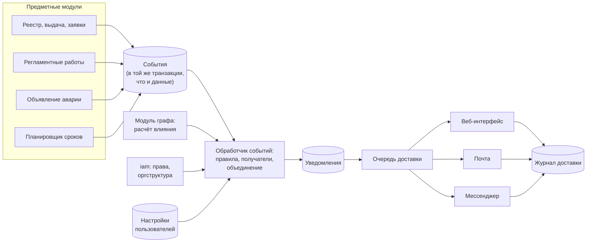
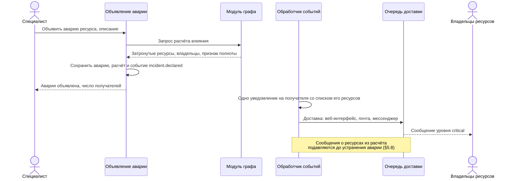
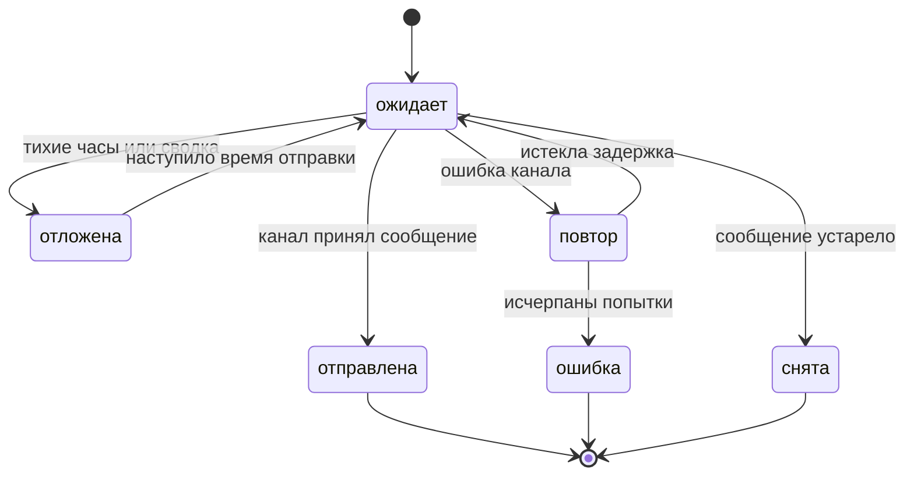

# 05. Оповещения

Этап: **постановка задачи и анализ решений**. Раздел определяет задачу подсистемы
оповещений, сравнивает готовые решения и фиксирует предварительный выбор.
Начальная редакция требований с идентификаторами и методами проверки включена в
[системные требования](requirements/system.md) и [требования к ПО](requirements/software.md).
Этот раздел содержит исходные сценарии и предварительные проектные решения.

## 5.1 Постановка задачи

**Назначение.** Подсистема оповещений сообщает пользователю о событии, которое
его касается, по выбранному им каналу и в срок, установленный для уровня важности
события.

**Входные данные:**

- события предметных модулей: реестра, выдачи, заявок, инвентаризации, регламентных
  работ, интеграций;
- расчёт влияния из модуля графа — перечень затронутых ресурсов и их владельцев;
- роли, права и оргструктура из модуля `iam`;
- настройки оповещений пользователя.

**Выходные данные:**

- уведомления в веб-интерфейсе системы;
- сообщения во внешних каналах: электронная почта, мессенджер;
- журнал доставки с состоянием каждой отправки.

**Не входит в задачу:**

- обнаружение сбоев: система не ведёт мониторинг, аварию объявляет пользователь
  (см. [раздел 01](01-vision.md), §1.4);
- дежурства по графику и автоматическая передача сообщения следующему дежурному;
- рассылки адресатам вне организации.

## 5.2 Сценарии

| № | Сценарий | Источник |
|---|---|---|
| О1 | **Объявление аварии.** Специалист в карточке ресурса или на графе нажимает «Объявить аварию» и вводит описание. Система получает расчёт влияния от модуля графа и отправляет каждому владельцу затронутых ресурсов одно сообщение со списком его ресурсов. Обновление и устранение аварии получают все адресаты объявления | Описание темы; сценарий U7 |
| О2 | **Истечение срока.** Владелец и `it_admin` получают напоминания об истечении лицензии, гарантии или сертификата; первое — при ежедневной проверке порога 30 суток, поздние данные обрабатываются по §5.8 | Сценарий U6; §1.7 |
| О3 | **Требуется действие.** Согласующий получает заявку, сотрудник — просьбу подтвердить получение ресурса или его наличие при инвентаризации | Сценарии U2, U4, U5 |
| О4 | **Сведения об изменении.** Сотрудник узнаёт о выдаче ресурса, смене владельца, решении по заявке | Сценарии U2, U3, U8 |
| О5 | **Регламентные работы.** Владельцы затронутых ресурсов узнают о плане, начале, изменении и результате работ | Сценарий U9; [раздел 07](07-maintenance.md), §7.9 |
| О6 | **Сбой интеграции.** `it_admin` узнаёт об ошибке синхронизации | [Раздел 04](04-integrations.md), §4.6 |

Сценарий О1 — основной для темы. Он определяет требования к скорости доставки,
к объединению сообщений и к взаимодействию с модулем графа.

## 5.3 Типы уведомлений и уровни важности

### Типы по назначению

| Тип | Назначение | Пример | Пользователь может отключить |
|---|---|---|---|
| Аварийное | Сообщает о недоступности ресурсов | Объявлена авария сервера | Нет |
| Требует действия | Получатель должен выполнить действие в системе | Согласовать заявку | Только внешние каналы |
| Напоминание | Повторно сообщает о приближении срока | Лицензия истекает через 7 суток | Только внешние каналы |
| Информационное | Сообщает о выполненном изменении | Ресурс выдан сотруднику | Да, может заменить сводкой |

Уведомление в веб-интерфейсе системы создаётся всегда. Настройки пользователя
определяют только внешние каналы, сводку и тихие часы.

**Сводка** — не отдельный тип и не канал, а режим доставки: информационные
уведомления за период передаются во внешний канал одним сообщением.

### Уровни важности

| Уровень | Идентификатор | Тихие часы | Сводка |
|---|---|---|---|
| Обычный | `info` | Внешняя отправка откладывается до их окончания | Допускается |
| Предупреждение | `warning` | Внешняя отправка откладывается до их окончания | Не допускается |
| Критический | `critical` | Не действуют | Не допускается |

Аварийные уведомления всегда имеют уровень `critical`.

## 5.4 Каталог событий

| Событие | Тип | Получатели по умолчанию | Уровень |
|---|---|---|---|
| `incident.declared` | Аварийное | Владельцы затронутых ресурсов, объявивший, `it_admin` | critical |
| `incident.updated` | Аварийное | Все получатели объявления | critical |
| `incident.resolved` | Аварийное | Все получатели объявления | critical |
| `resource.assigned` | Информационное | Новый владелец | info |
| `resource.assignment_pending_acceptance` | Требует действия | Владелец, через 3 суток без подтверждения | warning |
| `resource.return_requested` | Требует действия | Сотрудники ИТ-отдела | info |
| `resource.owner_changed` | Информационное | Прежний и новый владелец, руководитель команды | info |
| `resource.status_changed` | Информационное | Владелец; для ресурса с `criticality = critical` — его команда | info |
| `resource.cotenant_maintenance` | Информационное | Владельцы ресурсов на том же сервере | warning |
| `resource.expiring_soon` | Напоминание | Владелец, `it_admin` | warning |
| `resource.expired` | Требует действия | Владелец, `it_admin` | critical |
| `resource.orphaned` | Требует действия | `it_admin` | warning |
| `resource.discovered_unmanaged` | Требует действия | `it_admin` | warning |
| `resource.disappeared_at_provider` | Требует действия | Владелец, `it_admin` | warning |
| `request.created` | Требует действия | Согласующий | info |
| `request.approved`, `request.rejected` | Информационное | Заявитель | info |
| `request.awaiting_approval_too_long` | Напоминание | Согласующий и его руководитель | warning |
| `inventory.campaign_started` | Требует действия | Участники инвентаризации | info |
| `inventory.confirmation_overdue` | Напоминание | Участник и руководитель его команды | warning |
| `inventory.discrepancy_found` | Требует действия | `it_admin` | warning |
| `offboarding.started` | Требует действия | ИТ-отдел, руководитель сотрудника | warning |
| `offboarding.resources_not_returned` | Требует действия | `it_admin` | critical |
| `maintenance.*` | По [разделу 07](07-maintenance.md), §7.9 | По разделу 07, §7.9 | По §5.10 |
| `integration.sync_failed` | Требует действия | `it_admin` | warning |
| `budget.threshold_exceeded` | Информационное | Руководитель команды, `it_admin` | warning |

Объявлять, обновлять и снимать аварию могут пользователи с ролями `it_specialist`
и `it_admin`.

## 5.5 Анализ каналов доставки

Критерии сравнения: есть ли канал у каждого сотрудника, подтверждается ли доставка,
какие действуют ограничения, где хранятся переданные сведения.

| Канал | Подтверждение доставки | Ограничения | Где хранятся сведения | Вывод |
|---|---|---|---|---|
| Веб-интерфейс системы | Отметка о прочтении | Пользователь видит сообщение только после входа в систему | В системе | Обязательный базовый канал |
| Электронная почта (SMTP) | Только приём письма почтовым сервером; прочтение не подтверждается | Доставка занимает до нескольких минут; письмо может попасть в папку нежелательной почты | Почтовый сервер организации | Основной внешний канал: адрес есть у каждого сотрудника в каталоге |
| Telegram (Bot API) | Ответ сервера подтверждает приём сообщения | Бот пишет только пользователю, который сам начал с ним диалог; не более 1 сообщения в секунду в один диалог и около 30 сообщений в секунду всего | Внешний сервис вне организации | Кандидат |
| Яндекс Мессенджер (Bot API Яндекс 360 для бизнеса) | Ответ сервера подтверждает приём сообщения | Бот пишет только пользователям своей организации, если личные сообщения не запрещены их настройками; нужна подписка Яндекс 360 | Облако Яндекса | Кандидат, если выбран Яндекс Трекер |
| VK WorkSpace (Bot API) | Ответ сервера подтверждает приём сообщения | Нужно подключение организации к VK WorkSpace | Облако VK или сервер организации | Резервный кандидат |
| Mattermost | Ответ сервера подтверждает приём сообщения | Нужен собственный сервер | Сервер организации | Кандидат, если сведения о ресурсах нельзя передавать внешним сервисам |
| SMS | Отчёт оператора о доставке | Оплата каждого сообщения; 70 символов кириллицы в одном сообщении | Оператор связи | Не используется |

**Выводы:**

1. Веб-интерфейс системы и электронная почта обязательны: они есть у всех
   сотрудников и не требуют привязки учётных записей.
2. Мессенджер нужен для аварийных уведомлений: почта не гарантирует доставку
   за одну минуту. Конкретный мессенджер выбирается в теме интеграций
   ([раздел 04](04-integrations.md)).
3. Для мессенджера нужна привязка учётной записи пользователя (поле в `User`,
   [раздел 02](02-domain-model.md)). Если привязки нет, внешние сообщения
   доставляются только по почте.
4. Ограничение Telegram — около 30 сообщений в секунду — достаточно
   для объявления аварии: 500 получателей обрабатываются примерно за 17 секунд.

## 5.6 Анализ готовых решений

| Решение | Что это | Что подходит | Вывод |
|---|---|---|---|
| Novu | Платформа оповещений с открытым исходным кодом: центр уведомлений для веб-интерфейса, почта, SMS, мессенджеры, сводки, настройки пользователя по видам событий | Почти весь нужный набор функций | Целиком не берём: это отдельный сервис со своей базой данных и очередью, для прототипа избыточен, а проверку чужого кода мы не контролируем. Заимствуем модель: настройки по категориям, сводку, центр уведомлений |
| Apprise | Библиотека и утилита на Python для отправки сообщений в более чем 200 сервисов, включая почту, Telegram и Mattermost; лицензия BSD-2-Clause | Готовые адаптеры каналов с единым форматом адреса | Кандидат для адаптеров каналов, если серверная часть будет на Python. Решение — на этапе проектирования |
| ntfy | Сервис всплывающих уведомлений: сообщение отправляется HTTP-запросом PUT или POST в тему, получатели подписываются в приложении; разворачивается на собственном сервере | Простая мгновенная доставка | Не берём: каждому сотруднику пришлось бы ставить отдельное приложение |
| Prometheus Alertmanager | Маршрутизатор оповещений мониторинга: группировка, подавление, временное отключение | Приёмы борьбы с лавиной сообщений при аварии | Не берём: он обрабатывает сигналы мониторинга, а не предметные события. Заимствуем группировку и подавление (§5.8) |
| Zabbix, действия и эскалации | Отправка сообщений по шагам эскалации при отсутствии реакции | Эскалация к руководителю | Мониторинг не входит в задачу. Эскалация откладывается на период после прототипа |
| Opsgenie, PagerDuty | Облачные сервисы дежурств: эскалации, подтверждение получения аварийного сообщения | Подтверждение получения | Не рассматриваются: внешние платные сервисы; продажа Opsgenie прекращена 4 июня 2025 года, поддержка заканчивается 5 апреля 2027 года |
| Оповещения Яндекс Трекера | Трекер сообщает исполнителю и наблюдателям об изменениях задачи | Уведомления по внешним задачам | Не дублируем: если по событию создана задача в трекере, об изменениях задачи сообщает трекер. Граница согласуется с темой интеграций |

## 5.7 Анализ способов построения

| Вариант | Описание | Достоинства | Недостатки |
|---|---|---|---|
| А. Прямая отправка | Предметный модуль сам отправляет письмо или сообщение при выполнении операции | Мало кода | Сбой канала прерывает основную операцию; нет повторных попыток; правила получателей разнесены по модулям |
| Б. Собственная подсистема | Событие сохраняется вместе с предметными данными, фоновый обработчик применяет правила, адаптеры каналов отправляют сообщения с повторными попытками | Единые правила; повторные попытки и журнал доставки; соответствует общей архитектуре ([раздел 03](03-architecture.md), §3.6) | Больше собственного кода |
| В. Внешняя платформа | Предметные модули передают события в Novu | Готовые функции | Ещё один сервис; сведения о получателях дублируются; сложнее проверка |

**Выбран вариант Б.** Адаптеры каналов можно построить на библиотеке Apprise.

### Предварительная схема

Схема уточняется на этапе проектирования.

### Объявление аварии

### Состояния доставки

Доставка учитывается отдельно для каждой пары «уведомление — канал».

Отметку о прочтении имеет только уведомление в веб-интерфейсе. Для внешних каналов
прочтение не учитывается.

## 5.8 Ограничение числа сообщений

| Приём | Правило | Откуда заимствован |
|---|---|---|
| Группировка | Одно событие даёт одному пользователю одно уведомление со списком всех его ресурсов. Ежедневная проверка сроков объединяет новые напоминания в одно событие каждого вида за расчётную дату; повторный запуск использует то же событие | Alertmanager |
| Подавление | Пока авария не устранена, события `resource.status_changed` по ресурсам из её расчёта влияния не создают отдельных сообщений | Alertmanager |
| Ограничение частоты | Одно правило по одному ресурсу применяется не чаще интервала `throttle` | — |
| Исключение повторов | Повторная обработка события не создаёт второго уведомления тому же пользователю | — |
| Лесенка напоминаний | Напоминания за 30, 14, 7 и 1 сутки до срока | — |
| Тихие часы и сводка | Для уровня `info` по умолчанию включены | Novu |

Для аварийных событий и регламентных работ ограничение частоты и сводка
не применяются.

### Параметры по умолчанию

Значения предварительные и уточняются на этапе требований.

Ежедневная проверка обрабатывает ещё не отмеченные сроки напоминаний, наступившие
к моменту проверки. Для поздно внесённого ресурса или после перерыва создаётся одно
напоминание о ближайшем актуальном сроке; прошедшие ступени отдельно не рассылаются.
Для истёкшего срока создаётся сообщение об истечении. Повтор определяется по ресурсу,
виду срока, дате его окончания и ступени напоминания, а не по новому запуску проверки.
Изменение даты окончания создаёт новое основание; старые неотправленные напоминания снимаются.
Напоминания и сообщения об истечении образуют разные события с соответствующими
уровнями важности. Состав события и отметки обработанных оснований сохраняются
совместно; сбой не оставляет основание отмеченным без сохранённого события.

| Параметр | Значение |
|---|---|
| Время от объявления аварии до передачи сообщения во внешний канал | Не более 1 минуты при 500 получателях |
| `throttle` по умолчанию | 24 часа |
| Тихие часы | С 22:00 до 08:00 по часовому поясу пользователя |
| Время отправки ежедневной сводки | 09:00 по часовому поясу пользователя |
| Повторные попытки доставки | После первой неудачной отправки до 3 повторов; задержки 1, 5 и 25 минут от предыдущей неудачи |
| Напоминание о неподтверждённой выдаче | Через 3 суток после выдачи |

## 5.9 Предварительная модель данных

Полный состав полей определяется на этапе проектирования.

| Сущность | Назначение | Основные поля |
|---|---|---|
| `Event` | Произошедший факт | `event_id`, `event_type`, `entity_type`, `entity_id`, `payload`, `occurred_at` |
| `NotificationRule` | Правило администратора: для какого события, при каких условиях, кому и по каким каналам отправлять | `id`, `event_type`, `conditions` (тип ресурса, критичность, подразделение), `recipients` (роль, владелец ресурса, команда, указанные пользователи), `channels`, `template_id`, `throttle`, `enabled` |
| `Notification` | Уведомление одному пользователю об одном событии | `id`, `event_id`, `user_id`, `title`, `body`, `link`, `severity`, `created_at`, `read_at` |
| `NotificationRuleMatch` | Правило, применённое к уведомлению | `notification_id`, `rule_id`, `rule_snapshot` |
| `Delivery` | Отправка уведомления по одному каналу | `notification_id`, `channel`, `status`, `attempts`, `last_error`, `sent_at` |
| `Incident` | Объявленная авария | `id`, `resource_id`, `description`, `declared_by`, `declared_at`, `resolved_at`, ссылка на сохранённый расчёт влияния |

Правила целостности:

- `event_id` у уведомления обязателен; пара `(event_id, user_id)` уникальна;
- у уведомления сохраняются все сработавшие для получателя правила, а не одно;
  `rule_snapshot` хранит параметры правила на момент применения, и его последующее
  изменение копию не меняет; пара `(notification_id, rule_id)` уникальна;
- каналы всех сработавших правил объединяются без повторов с учётом настроек
  пользователя; пара `(notification_id, channel)` в `Delivery` уникальна;
- уведомление и связи с применёнными правилами сохраняются одной транзакцией;
  повторная обработка использует сохранённые текст и связи;
- сводка — это одна отправка во внешний канал, объединяющая несколько уведомлений;
  отдельного уведомления она не создаёт.

Защита от повторного письма или сообщения во внешнем канале полная только в том
случае, если канал сам исключает повторы. Если подтверждение от канала потеряно,
повторная попытка может доставить второе сообщение; новой записи уведомления
при этом не создаётся.

Какой модуль хранит `Incident` — вопрос распределения модулей (§5.11).

## 5.10 Уведомления о регламентных работах

События и обязательные группы получателей определены в [разделе 07](07-maintenance.md),
§7.9. Модуль работ сохраняет событие и расчёт затронутых ресурсов, подсистема
оповещений выбирает пользователей и каналы по правилам и правам доступа.
Неполнота расчёта и ожидаемая недоступность указываются в сообщении явно.

Уровни важности:

| Уровень | События |
|---|---|
| `info` | Публикация, успешное завершение, напоминание за 7 суток, дополнительное сообщение |
| `warning` | Напоминание за 1 сутки, начало, изменение, отмена, восстановление прежней конфигурации, запрос согласования, просрочка, выход за допустимое время |
| `critical` | Неудачный или частичный результат, отказ при последующем согласовании аварийных работ, аварийное начало без полного расчёта |

При нескольких основаниях выбирается наибольший уровень.

Особые правила:

- изменение плана, отмена и завершение — разные события: каждое создаёт свои
  уведомления, они не подавляют друг друга и не объединяются в сводку;
- напоминание уникально по окну, редакции плана и сроку напоминания; после
  изменения сроков необработанные напоминания прежней редакции снимаются с отправки;
- события `resource.status_changed` и `resource.cotenant_maintenance`, относящиеся
  к тому же окну, отдельных сообщений не создают;
- сохраняется список всех получателей по окну; изменение, отмена и результат
  направляются и прежним получателям, а не только владельцам текущего состава ресурсов;
- перед отправкой проверяются актуальность редакции, состояние окна и права
  получателя; сведения, недоступные получателю, скрываются;
- прежний получатель без текущего доступа получает сообщение об изменении ранее
  объявленных работ без закрытых сведений и без ссылки на них;
- переданное внешнему каналу сообщение не отзывается: изменение или отмена
  оформляются новым сообщением.

## 5.11 Вопросы к смежным темам

| Тема | Вопрос |
|---|---|
| 1. Видение и доменная область | В каком модуле хранится `Incident`; добавить сценарий объявления аварии в раздел 01 |
| 2. Интеграции | Какой мессенджер выбран; как пользователь привязывает учётную запись; где граница между оповещениями системы и уведомлениями трекера |
| 4. Граф | Расчёт влияния при аварии использует обратные `depends_on` и `hosted_on`, как регламентные работы; результат содержит признак полноты. Представление «Состав» также показывает `part_of`, но эта связь пока не распространяет влияние автоматически; расширение рассматривается по ОВ-07 |
| 5. Регламентные работы | Уровни важности из §5.10 согласовать с §7.9 раздела 07 |
| 6. Проверка | Методы проверки: испытание доставки по каждому каналу, анализ полноты правил (у каждого события из §5.4 есть правило по умолчанию), рассмотрение шаблонов сообщений |

## 5.12 Передача на следующие этапы

**Этап требований.** Проверить начальные требования `СТ-УВД` и `ТП-УВД` в общих
спецификациях. Параметры §5.8 остаются предложениями до решения ОВ-04 в
[перечне открытых вопросов](open-questions.md).

**Этап проектирования.** Полная модель данных, программные интерфейсы, шаблоны
сообщений, выбор библиотеки адаптеров каналов.

**Предлагаемый порядок реализации прототипа:**

1. Уведомления в веб-интерфейсе системы — не требуют внешних сервисов.
2. Объявление аварии и рассылка по расчёту влияния — основной сценарий О1.
3. Почта через SMTP.
4. Планировщик проверки сроков (`expiring_soon`, `expired`).
5. Настройки пользователя, тихие часы, сводка.
6. Мессенджер и редактирование правил администратором.

## Источники

- [Telegram Bot API: ограничения частоты](https://core.telegram.org/bots/faq)
- [Bot API Яндекс Мессенджера](https://yandex.ru/dev/messenger/doc/ru/api-requests/message-send-text)
- [Боты и API Яндекс Мессенджера: ограничения](https://yandex.ru/support/yandex-360/business/admin/ru/messenger/bot-platform)
- [Bot API VK WorkSpace](https://workspace.vk.ru/docs/saas/vks-messenger/messenger/bot/index.html)
- [Novu](https://docs.novu.co/platform/what-is-novu)
- [Apprise](https://github.com/caronc/apprise)
- [ntfy](https://docs.ntfy.sh/)
- [Prometheus Alertmanager](https://prometheus.io/docs/alerting/latest/alertmanager/)
- [Сроки прекращения поддержки Opsgenie](https://www.adaptavist.com/blog/atlassian-opsgenie-availability-changes-effective-june-4-2025)
