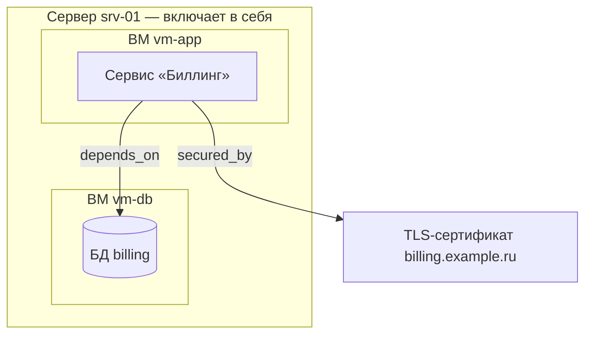
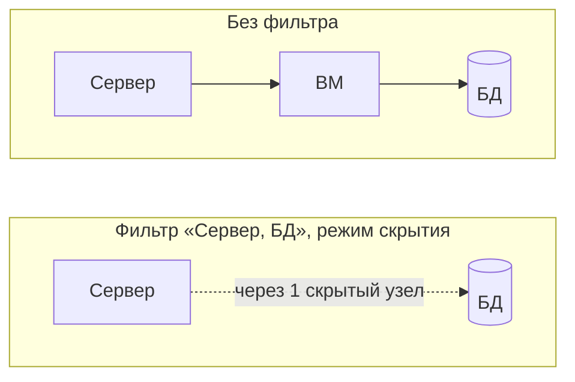

# 06. Граф ресурсов

Этап: **постановка задачи и анализ решений**. Раздел определяет задачу графового
представления, пользовательские сценарии и фильтры, сравнивает готовые решения
для отображения и хранения графа и фиксирует предварительный выбор. Начальные
требования `СТ-ГР` и `ТП-ГР` выделены в [системную спецификацию](requirements/system.md)
и [спецификацию ПО](requirements/software.md). Выбор средств в §6.7–6.8 является
предварительным предложением для общего решения ОВ-03. Полная модель данных
уточняется на этапе проектирования.

## 6.1 Постановка задачи

**Назначение.** Граф показывает ресурсы и связи между ними и отвечает на вопросы,
на которые таблица реестра не отвечает:

- что размещено на сервере или входит в кластер;
- где размещён ресурс: цепочка до физического сервера и локации;
- что может перестать работать при отказе или обслуживании ресурса и кто владельцы;
- от чего зависит сервис;
- какие ещё ресурсы размещены на том же сервере;
- какие ресурсы ни с чем не связаны и, возможно, не используются;
- что подключено к ресурсам сотрудника, которые нужно вернуть при увольнении.

**Входные данные:**

- ресурсы и их типы из реестра ([раздел 02](02-domain-model.md));
- связи между ресурсами;
- владение и оргструктура;
- права доступа пользователя.

**Выходные данные:**

- изображение подграфа с фильтрами;
- расчёт влияния — перечень затронутых ресурсов с владельцами и основаниями включения —
  для оповещений ([раздел 05](05-notifications.md)) и регламентных работ
  ([раздел 07](07-maintenance.md));
- списки узлов для выгрузки.

**Не входит в задачу:**

- обнаружение связей по сетевому трафику и мониторинг доступности;
- управление инфраструктурой: граф показывает внесённые связи и не изменяет
  реальные серверы.

## 6.2 Модель графа

### Вершины и рёбра

- **Вершина** — ресурс. Тип ресурса (`ResourceType`) определяет значок узла
  и участвует в фильтрах. Все категории — оборудование, облако, данные, сервисы,
  лицензии, сеть — находятся в одном графе.
- **Ребро** — связь `ResourceRelation` с типом. Типы связей определены
  в [разделе 02](02-domain-model.md), §2.2: `depends_on`, `hosted_on`,
  `connected_to`, `part_of`, `licensed_by`, `backup_of`, `secured_by`.
- Граф ориентированный, циклы допускаются и обрабатываются при обходе.
- Пользователи и подразделения не являются вершинами. Владелец отображается
  как свойство узла, иначе связи владения закрывают связи между ресурсами.

### Связь «включает в себя»

В описании темы ребро графа — «включает в себя»: сервер включает виртуальные машины,
виртуальная машина — базы данных и сервисы. В текущей модели это отношение
задано двумя типами в обратном направлении: `hosted_on` (размещён на)
и `part_of` (входит в состав).

| Вариант | Описание | Достоинства | Недостатки |
|---|---|---|---|
| А. Один тип `contains` | Заменить `hosted_on` и `part_of` одним типом с направлением от включающего ресурса к включённому | Модель совпадает с описанием темы | Требуется изменить разделы 02 и 07 и задачи E9, E13; различие «размещён» и «входит в состав» теряется |
| Б. Представление поверх хранимых типов | Хранить `hosted_on` и `part_of`; на экране и в запросах показывать их от включающего ресурса как «включает в себя» | Разделы 02 и 07 не меняются; различие типов сохраняется | Название отношения на экране отличается от названия типа в хранилище |
| В. Добавить `contains` к существующим | Хранить все три типа | — | Одно отношение можно записать тремя способами; нарушается неизбыточность модели |

**Рекомендуется вариант Б.** Отношение «включает в себя» определяется так:
ресурс X включает ресурс Y, если есть связь `Y hosted_on X` или `Y part_of X`.
Представление «Состав» (§6.6) строится по этому отношению. Решение требует
согласования с темами 1 и 5 (§6.13).

### Пример



Вложенные рамки показывают отношение «включает в себя», стрелки — остальные типы
связей. При отказе сервера `srv-01` затронуты обе виртуальные машины, база данных
и сервис; сертификат не затронут.

## 6.3 Способы получения связей

| Способ | Описание |
|---|---|
| Вручную | Специалист добавляет связь в карточке ресурса или на графе |
| Из импорта | Провайдер сообщает связи: база данных размещена на виртуальной машине, узел входит в кластер |
| По правилам | Связь создаётся для ресурсов одной подсети или с общей меткой, например `service=billing` |
| Из конфигураций | Разбор манифестов и переменных окружения; необязательный поздний этап |

У связи сохраняется источник (`source`: `manual`, `import`, `rule`), чтобы импорт
не заменял связи, внесённые человеком.

## 6.4 Пользовательские сценарии

| № | Сценарий | Кто | Результат | Источник |
|---|---|---|---|---|
| Г1 | **Состав ресурса.** Пользователь открывает сервер и видит, что он включает в себя | Специалист, администратор; сотрудник — в пределах прав | Вложенные рамки: сервер, виртуальные машины, размещённые ресурсы | Описание темы |
| Г2 | **Размещение ресурса.** Из карточки сервиса пользователь переходит к цепочке размещения | Все роли в пределах прав | Путь от сервиса до физического сервера и его локации | §6.1 |
| Г3 | **Расчёт влияния.** Пользователь выбирает ресурс и включает режим влияния | Специалист, администратор | Подсвечены затронутые ресурсы; список с владельцами и основаниями включения | Сценарий U7; раздел 07, §7.4 |
| Г4 | **Объявление аварии.** Из режима влияния специалист объявляет аварию | Специалист, администратор | Рассылка владельцам затронутых ресурсов | [Раздел 05](05-notifications.md), сценарий О1 |
| Г5 | **Фильтр по типам.** Пользователь оставляет на графе выбранные типы или категории ресурсов | Все роли | Граф содержит узлы выбранных типов; связность сохранена по §6.5 | Описание темы |
| Г6 | **Зависимости сервиса.** Пользователь смотрит, от чего зависит сервис | Все роли в пределах прав | Цепочки `depends_on` по направлению связи | §6.1 |
| Г7 | **Соседи по серверу.** Перед работами специалист смотрит ресурсы на том же сервере | Специалист | Соседи выделены отдельным цветом, указаны владельцы и критичность | Раздел 07, §7.4 |
| Г8 | **Несвязанные ресурсы.** Администратор показывает узлы без связей и сервисы без размещения | Администратор | Список для проверки; сервисы без размещения нарушают правило §2.5 раздела 02 | §6.1 |
| Г9 | **Рабочее место.** Сотрудник смотрит связи своих ресурсов: ноутбук, док-станция, мониторы, лицензии | Сотрудник | Граф его ресурсов; при увольнении — перечень того, что вернуть | Сценарии U1, U8 |
| Г10 | **Изменение связей.** Специалист добавляет или удаляет связь на графе, в том числе перетаскивает ресурс в состав сервера | Специалист, администратор | Связь сохранена с источником `manual`, изменение записано в журнал изменений | §6.3 |
| Г11 | **Обзор инфраструктуры.** Администратор смотрит весь граф с объединением узлов по командам или типам | Администратор | Обзорный граф; группы раскрываются по запросу | §6.6 |

Сценарии Г1 и Г5 — основные для темы, Г3 и Г4 связывают граф с оповещениями
и регламентными работами.

## 6.5 Фильтры

### Измерения

| Измерение | Значения | По умолчанию |
|---|---|---|
| Категория типа | `hardware`, `cloud`, `data`, `service`, `software`, `network` | Все |
| Тип ресурса | Типы из справочника `ResourceType`; рядом с каждым — число узлов в текущем подграфе | Все |
| Тип связи | Типы из §6.2 и отношение «включает в себя» | Все |
| Статус | Статусы жизненного цикла ([раздел 02](02-domain-model.md), §2.4) | Все, кроме `decommissioned` |
| Среда | `prod`, `stage`, `dev`, `office` | Все |
| Команда | Подразделения, доступные пользователю | Все доступные |
| Критичность | `low`, `medium`, `high`, `critical` | Все |
| Глубина | От 1 до 5 | 2 |

Условия разных измерений объединяются через «И», значения одного измерения —
через «ИЛИ». Исходный узел отображается всегда, даже если не проходит фильтр.
Это правило относится только к доступному узлу: запрос графа недоступного корня отклоняется.

### Поведение при скрытии узлов

Если скрыть промежуточные узлы, граф распадается: при фильтре «серверы и базы
данных» теряется связь между сервером и базой, потому что виртуальная машина
между ними скрыта.

| Режим | Поведение | Когда использовать |
|---|---|---|
| Затемнение (по умолчанию) | Узлы, не прошедшие фильтр, остаются на месте бледными | Нужна полная структура |
| Скрытие | Узлы убираются; если два видимых узла связаны только через скрытые, между ними рисуется пунктирная связь с числом скрытых узлов | Нужна короткая картина из выбранных типов |

Затемнение и подсчёт промежуточных узлов относятся к пользовательским фильтрам,
а не к ограничениям доступа. Закрытые сведения сначала исключаются по §6.12;
изменение фильтра не раскрывает название, свойства или идентификатор закрытого узла.



### Наборы фильтров

| Набор | Типы ресурсов |
|---|---|
| Инфраструктура | Сервер, виртуальная машина, кластер, база данных, внутренний сервис |
| Рабочее место | Ноутбук, монитор, док-станция, телефон, лицензия |
| Сеть | Домен, TLS-сертификат, VPN, IP-подсеть |

Администратор может добавлять наборы. Состояние фильтров сохраняется в адресе
страницы, поэтому ссылку на отфильтрованный граф можно передать другому пользователю.
Он увидит только узлы, доступные ему по правам (§6.12).

Фильтры изображения не влияют на расчёт влияния для оповещений и регламентных
работ: расчёт выполняется по всем связям поддержанных типов.

## 6.6 Представления

### Локальный граф — основной режим

Строится от одного ресурса: соседи на заданную глубину, по умолчанию 2. Узел
раскрывается по щелчку. Режим используется и сотрудником, и администратором.

### Состав

Строится по отношению «включает в себя» (§6.2). Включённые ресурсы изображаются
внутри рамки включающего ресурса: сервер содержит виртуальные машины, виртуальная
машина — базы данных и сервисы. Остальные связи показываются стрелками.
Представление реализует сценарии Г1 и Г2.

Вложенные рамки применяются к участку без циклов, где у каждого включённого ресурса
один включающий ресурс. При цикле или нескольких включающих ресурсах состав
показывается направленными типизированными связями; отношения не удаляются
и вершина не выдаётся за несколько разных ресурсов.

### Зависимости и влияние

- По направлению `depends_on`: от чего зависит выбранный ресурс.
- Против направления `depends_on`: какие ресурсы зависят от выбранного.
- Для расчёта влияния учитываются также обратные связи `hosted_on`: сначала
  размещённые ресурсы, затем зависимые от них; правила — в разделе 07, §7.4.

В программном интерфейсе `downstream` обозначает обход по направлению связи,
`upstream` — против направления, `both` — в обоих направлениях. На экране
используются смысловые подписи, а не расположение узла выше или ниже. Результат
расчёта влияния содержит ресурсы, владельцев, основания включения и признак полноты.

### Соседи по серверу

Отвечает на вопрос, какие ещё ресурсы размещены на той же машине. Отдельная
сущность не нужна: соседи получаются из связей `hosted_on` за два шага —
`A hosted_on сервер`, `B hosted_on сервер`.

- В подписи узла сервиса или базы данных отображается имя сервера, на котором он размещён.
- Узлы одного сервера обводятся общей рамкой.
- На узле сервера отображается число размещённых на нём ресурсов.
- При выборе сервиса соседи по серверу выделяются цветом, отличным от цвета
  зависимостей: это совместное использование оборудования, а не зависимость.

Перед планированием работ показываются соседи по серверу, их критичность
и владельцы. Соседство не доказывает недоступность соседнего приложения
при перезапуске выбранного. Если обслуживается сам сервер, размещённые на нём
ресурсы учитываются в расчёте влияния по обратным связям `hosted_on`.

Модуль графа возвращает сведения о связях и не принимает решений о начале работ.
Условия согласования определены в разделе 07, §7.5. Предупреждение о соседстве
не заменяет проверки полноты расчёта и разрешения на начало.

### Обзорный граф

Весь граф с фильтрами. По умолчанию узлы объединены по подразделениям или типам
и раскрываются по запросу: без объединения 10 000 узлов нечитаемы.

### Групповые представления

Узлы группируются рамками по среде (`prod`, `stage`, `dev`), локации или команде.

## 6.7 Анализ готовых решений для отображения

### Платформы

Преподаватель предложил начать с анализа платформ Obsidian и Gramax.

| Решение | Что это | Что подходит | Что не подходит | Вывод |
|---|---|---|---|---|
| Obsidian | Приложение для заметок в файлах Markdown со ссылками; вид графа: общий и локальный с глубиной, фильтры по поиску, меткам и несвязанным заметкам, раскраска групп по запросу, стрелки направления, настройка сил раскладки. С 20 февраля 2025 года бесплатно и для работы | Модель взаимодействия: локальный граф с глубиной, раскраска по типу, скрытие несвязанных узлов | Связи на графе не типизированы; нет ролей и прав доступа; настольное приложение одного пользователя, без веб-доступа для сотрудников; нет транзакций, оповещений и интеграций | Как основу системы не берём. Заимствуем модель взаимодействия. Годится для демонстрации: 20–30 заметок-ресурсов показывают идею графа на этапе 1 |
| Gramax | Платформа документации с открытым исходным кодом: Markdown в git, визуальный редактор, диаграммы Mermaid, PlantUML, Draw.io, разворачивается на собственном сервере | Хранение и публикация проектной документации | Графа связей между страницами нет; ресурсы и связи не моделируются | Для графа ресурсов не подходит. Возможен для публикации документации проекта |
| NetBox с модулем netbox-topology-views | Система учёта инфраструктуры; модуль строит карту устройств по кабельным соединениям с фильтрами по площадке, метке и роли, сохраняет положение узлов | Аналог учёта серверов и схемы соединений | Только сетевое оборудование и кабели; нет лицензий, сервисов и выдачи сотрудникам | Аналог для сравнения; заимствуем сохранение положения узлов |

### Библиотеки отображения

Критерии: вложенные узлы для отношения «включает в себя», силовая и иерархическая
раскладки, объём отображения, лицензия, объём собственного кода.

| Библиотека | Вложенные узлы | Раскладки | Отрисовка | Лицензия | Вывод |
|---|---|---|---|---|---|
| Cytoscape.js | Есть: составные узлы с дочерними | Встроены: концентрическая, сетка, CoSE; расширения: fCoSE, Dagre, ELK | Canvas | MIT | **Выбрана**: составные узлы прямо реализуют представление «Состав», селекторы стилей реализуют фильтры |
| vis-network | Нет: объединение узлов в один сворачиваемый узел, без вложенных рамок | Силовая, иерархическая | Canvas | Apache-2.0 или MIT | Запасной вариант |
| D3.js (d3-force) | Нет готовых | Силовая; остальные — собственным кодом | SVG или Canvas | ISC | Слишком много собственного кода |
| Sigma.js с graphology | Нет | Силовая ForceAtlas2 из graphology | WebGL, тысячи узлов | MIT | Для обзорного графа, если Cytoscape.js не справится с объёмом |
| React Flow | Есть: вложенные узлы | Автоматической раскладки нет, нужен Dagre или ELK | SVG | MIT | Предназначен для редакторов схем, а не для больших графов |
| Graphviz | Есть: кластеры | Иерархическая | Статичное изображение | EPL | Только для выгрузки изображений и документации |

## 6.8 Анализ способов хранения

Ожидаемый объём: около 10 000 ресурсов и 30 000 связей
([раздел 03](03-architecture.md), §3.7).

| Вариант | Описание | Достоинства | Недостатки | Вывод |
|---|---|---|---|---|
| Таблица связей в PostgreSQL | Таблица `ResourceRelation (source_id, target_id, relation_type)`; обход рекурсивным запросом `WITH RECURSIVE`, начиная с PostgreSQL 14 циклы отслеживает предложение `CYCLE` | Одна база данных; связи меняются в одной транзакции с реестром и регламентными работами; права проверяются теми же запросами | Обход глубиной 5 и более по всему графу медленнее, чем в графовой базе | **Выбран** |
| Таблица замыкания для «включает в себя» | Хранятся все пары «включающий ресурс — включённый ресурс» на любой глубине | Состав и размещение получаются одним запросом без рекурсии | Пересчёт при каждом изменении связи; подходит только для иерархии | Оптимизация, если сценарии Г1 и Г2 окажутся медленными |
| Apache AGE | Расширение PostgreSQL: графовое хранилище и запросы openCypher вместе с SQL | Запросы к графу на Cypher без отдельной базы | Граф хранится в отдельной схеме, связь с таблицами реестра поддерживается вручную; команде нужно изучать Cypher | На ожидаемом объёме не нужен |
| Neo4j | Отдельная графовая база данных | Быстрые глубокие обходы, язык Cypher | Вторая база данных и синхронизация с реестром; нет общих транзакций; Community Edition распространяется по GPLv3 | Не вводится |
| Файлы Markdown, как в Obsidian или Gramax | Ресурс — файл, связь — ссылка | Наглядно, история изменений в git | Нет транзакций, прав доступа и быстрых запросов по 10 000 файлов | Для системы не подходит; годится для демонстрации |

Решение о графовой базе пересматривается, если появятся запросы глубиной 5
и более по всему графу, а рекурсивные запросы не уложатся в пределы §6.11.

## 6.9 Визуальное кодирование

| Средство | Что обозначает |
|---|---|
| Значок или форма узла | Тип ресурса |
| Цвет узла | Тип ресурса, статус или критичность — по выбору пользователя |
| Размер узла | Число связей или стоимость — по выбору пользователя |
| Вложенная рамка | Отношение «включает в себя» |
| Стиль ребра | Тип связи: сплошная — `depends_on`, штриховая — `connected_to`, остальные — по легенде |
| Пунктирное ребро с числом | Связь через скрытые фильтром узлы (§6.5) |
| Затемнение | Узлы вне выбранного пути или фильтра |

Обязательные элементы экрана: легенда, поиск узла с переносом его в центр,
панель фильтров, боковая панель с карточкой выбранного узла, выгрузка изображения
в PNG и SVG и списка узлов в CSV.

Раскладки: силовая — для локального графа, иерархическая сверху вниз — для
зависимостей, вложенная — для состава. Положение узлов, расставленных вручную,
можно сохранять.

## 6.10 Предварительный программный интерфейс

```
GET /api/v1/resources/{id}/graph
    ?depth=2
    &direction=both|upstream|downstream
    &relation_types=depends_on,hosted_on
    &resource_types=database,service
    → { nodes: [...], edges: [...], truncated: bool }

GET /api/v1/resources/{id}/composition
    ?depth=3
    → вложенный состав по отношению «включает в себя»

GET /api/v1/graph
    ?org_unit=...&environment=prod&group_by=org_unit
    → обзорный граф с объединением узлов

GET /api/v1/resources/{id}/impact
    ?include_cotenants=true
    → { dependents: [...], cotenants: [...], truncated: bool, reason: ... }
      затронутые ресурсы и соседи по серверу; у каждого — владелец,
      критичность и основания включения
```

Ответ всегда содержит логический признак `truncated`. При ограничении результата
он равен `true` и сопровождается причиной. Параметры изображения и фильтры
пользователя не определяют полноту служебного расчёта влияния для работ.
Постраничная выдача полного списка не считается вычислительным ограничением.

## 6.11 Производительность и ограничения

- Предварительная цель для изображения подграфа глубиной три — 2 секунды
  по СТ-КАЧ-02. Условия измерения ещё определяются по ОВ-04
  ([раздел 03](03-architecture.md), §3.7).
- Для изображения подграфа действуют ограничения глубины и числа узлов:
  начальная глубина два, выбор от одного до пяти по §6.5, не более 500 узлов.
  Расчёт влияния для обслуживания
  выполняется отдельно до исчерпания достижимых узлов по правилам раздела 07, §7.4.
  Если вычислительное ограничение не позволило завершить расчёт, результат неполон
  и не разрешает обычное согласование или начало работ.
- При обходе отслеживаются посещённые узлы, поэтому циклы не приводят
  к повторной обработке.
- Соседи по серверу получаются двухшаговым обходом по `hosted_on` без отдельного
  хранения. Отдельное поле «сервер» у ресурса вводится, только если подписи узлов
  замедлят вывод списков.
- Сохранённый подграф зависит от корневого ресурса, параметров и редакции связей.
  Перед каждой выдачей проверяются текущие права пользователя; результат
  не выдаётся по сохранённым ранее правам. Для согласования и начала работ проверяется актуальность
  не только связей, но и владельцев, подразделений, критичности и среды ресурсов.

## 6.12 Видимость и права

Граф учитывает права доступа: сотрудник видит только доступные ему узлы.
Недоступные соседи отображаются как «скрытый ресурс» без сведений о нём,
чтобы связь не пропадала, а закрытые данные не раскрывались.

Для вложенного размещения проверка пересечения работ проходит по всей известной
цепочке `hosted_on`; список непосредственных соседей её не заменяет. При расчёте
влияния исходные ресурсы, найденные ресурсы и все основания включения объединяются
без повторных записей. Служебный расчёт выполняется с доступом ко всему реестру,
а его результат выдаётся каждому пользователю в пределах его прав. Полнота расчёта
относится к внесённым связям поддержанных типов, а не к доказанной полноте
реальной инфраструктуры.

## 6.13 Вопросы к смежным темам

| Тема | Вопрос |
|---|---|
| 1. Видение и доменная область | Принять вариант Б из §6.2 для отношения «включает в себя»; добавить сценарии Г1 и Г5 в раздел 01 |
| 3. Оповещения | Расчёт влияния для объявления аварии использует тот же обход, что и для работ; состав полей результата согласовать с §5.9 раздела 05 |
| 5. Регламентные работы | Вариант Б не меняет правила §7.4; при выборе варианта А раздел 07 нужно переписать с `hosted_on` на `contains` |
| 6. Проверка | Методы проверки: испытание обхода на графе с циклами и вложенностью, анализ времени построения на объёме 10 000 узлов, рассмотрение легенды и фильтров |

## 6.14 Передача на следующие этапы

**Этап требований.** Проверить начальные требования `СТ-ГР` и `ТП-ГР` по
§6.4–6.12, дополнить их после решения открытых вопросов. Номера и способы
проверки оформляются по [стандарту](requirements-standard.md).

**Этап проектирования.** Схема таблиц, рекурсивные запросы, полный программный
интерфейс, построение пунктирных связей через скрытые узлы.

**Предлагаемый порядок реализации прототипа:**

1. Таблица связей и программный интерфейс подграфа с обходом и защитой от циклов.
2. Локальный граф на Cytoscape.js с фильтром по типам ресурсов — сценарий Г5.
3. Представление «Состав» с вложенными рамками — сценарии Г1 и Г2.
4. Расчёт влияния — нужен для объявления аварии и регламентных работ.
5. Изменение связей на графе.
6. Обзорный граф с объединением узлов.

## Источники

- [Obsidian: вид графа](https://obsidian.md/help/plugins/graph)
- [Obsidian: бесплатное использование для работы](https://obsidian.md/blog/free-for-work/)
- [Gramax](https://gram.ax/)
- [netbox-topology-views](https://github.com/netbox-community/netbox-topology-views)
- [Cytoscape.js](https://js.cytoscape.org/)
- [Sigma.js](https://www.sigmajs.org/)
- [Apache AGE](https://age.apache.org/overview/)
